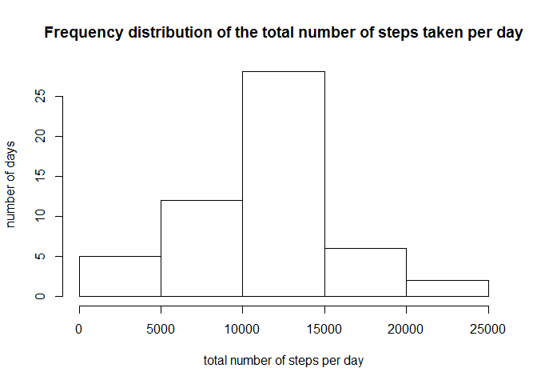
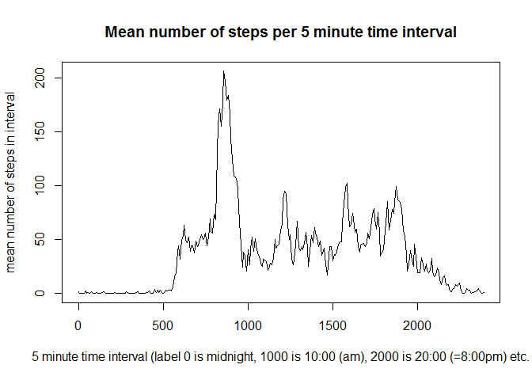
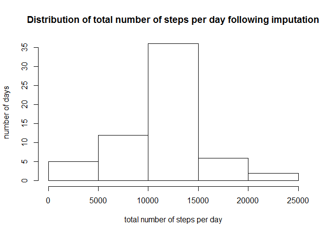
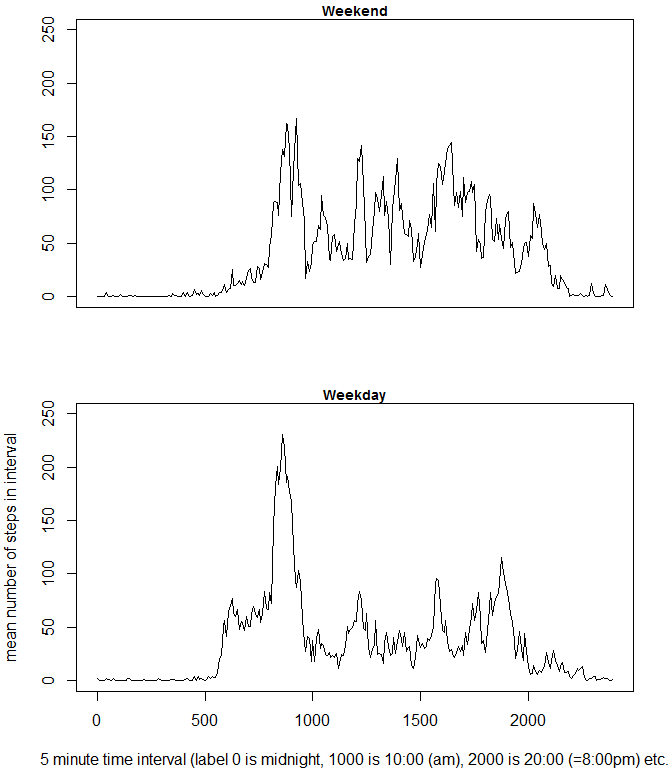

# Reproducible Research: Peer Assessment 1


## Loading and preprocessing the data
Adding intcode simplifies the summarising process.  Note that the intervals are coded as 0, 5, 10,... 2355.  This does not affect the calculation but the time series plotting is done against a new variable realtime which represents the genuine time intervals (hence no large gap between the (successive) intervals coded 55 and 100).  This variable is calculated in the section on average daily activity pattern.


```r
library(dplyr)
```

```
## 
## Attaching package: 'dplyr'
## 
## The following object is masked from 'package:stats':
## 
##     filter
## 
## The following objects are masked from 'package:base':
## 
##     intersect, setdiff, setequal, union
```

```r
options(scipen=1,digits=2)
file<-"C:/Users/Andy/Desktop/RepData_PeerAssessment1/activity/activity.csv"
data<-read.csv(file,header=TRUE,sep=",")
data<-mutate(data,intcode=as.factor(interval))
```
## What is mean total number of steps taken per day?

```r
daytotal<-tapply(data$steps,data$date,sum)
hist(daytotal,main="Frequency distribution of the total number of steps taken per day",xlab="total number of steps per day",ylab="number of days")
```

 

```r
mediandaytotal<-median(daytotal,na.rm=TRUE)
meandaytotal<-mean(daytotal,na.rm=TRUE)
```
The mean total number of steps taken per day is 10766.19.
The median total number of steps taken per day is 
10765.

## What is the average daily activity pattern?


```r
meanbytimeinterval<-tapply(data$steps,data$intcode,mean,na.rm=TRUE)
timecode<-tapply(data$interval,data$intcode,mean,na.rm=TRUE)
realtime<-c(0:287)*2400/288
plot(realtime,meanbytimeinterval,type="l", main="Mean number of steps per 5 minute time interval", xlab="5 minute time interval (label 0 is midnight, 1000 is 10:00 (am), 2000 is 20:00 (=8:00pm) etc.", ylab="mean number of steps in interval")
```

 

```r
maxvalue<-meanbytimeinterval[meanbytimeinterval==max(meanbytimeinterval)]
maxtime<-names(maxvalue)
```

The 5 minute interval which, on average across all the days in the dataset, contains the maximum number of steps is the interval coded as 835.

## Imputing missing values

```r
missingsteps<-sum(is.na(data$steps))
missingdate<-sum(is.na(data$date))
missinginterval<-sum(is.na(data$interval))
incomplete<-sum(is.na(data$steps)|is.na(data$date)|is.na(data$interval))
```

There are 2304 rows with a missing value for "steps", 0 rows with a missing value for "date", 0 rows with a missing value for "interval" and 2304 rows with one or more items missing.

The missing values are imputed by replacing them with the mean of the values present for that interval


```r
impute<-function(var,fac,lev){
    missing<-is.na(var)
    level<-fac==levels(fac)[lev]
    groupmean<-mean(var[level],na.rm=TRUE)
    var[missing&level]<-groupmean
    return(var)
}
for(i in 1:nlevels(data$intcode)) {
     data$steps<-impute(data$steps,data$intcode,i)
}
stillmissing<-sum(is.na(data$steps))
```

Following imputation there are now 0 missing values in the dataset.  Note that there were by inspection no cases where all data for one time interval were missing, so this case is not handled in the code.


```r
newdaytotal<-tapply(data$steps,data$date,sum)
hist(newdaytotal,main="Distribution of total number of steps per day following imputation",xlab="total number of steps per day",ylab="number of days")
```

 

```r
newmediandaytotal<-median(newdaytotal)
newmeandaytotal<-mean(newdaytotal)
diff_median<-newmediandaytotal-mediandaytotal
diff_mean<-newmeandaytotal-meandaytotal
```

Following imputation of missing values, the mean total number of steps taken per day is 10766.19. This is a change (new-old) of 0.
Following imputation of missing values, the median total number of steps taken per day is 10766.19.  This is a change (new-old) of 1.19.

## Are there differences in activity patterns between weekdays and weekends?

```r
data<-mutate(data,day=weekdays(as.Date(as.character(date))))
data<-mutate(data,wend=factor(day=="Saturday"|day=="Sunday"))
levels(data$wend)<-c("Weekday","Weekend")

wdaysteps<-data$steps[data$wend=="Weekday"]
wdaytime<-data$intcode[data$wend=="Weekday"]
wendsteps<-data$steps[data$wend=="Weekend"]
wendtime<-data$intcode[data$wend=="Weekend"]
wdaymean<-tapply(wdaysteps,wdaytime,mean)
wendmean<-tapply(wendsteps,wendtime,mean)
```


```r
par(mfrow=c(2,1),mar=c(4,4,1,2),cex.main=0.9)
plot(realtime,wendmean,type="l",main="Weekend",ylim=c(0,250),ylab="",xlab="",xaxt="n")
par(mar=c(4,4,1,2))
plot(realtime,wdaymean,type="l",xlab="5 minute time interval (label 0 is midnight, 1000 is 10:00 (am), 2000 is 20:00 (=8:00pm) etc.",ylim=c(0,250),ylab="mean number of steps in interval",main="Weekday")
```

 

The weekday peak of activity is much more pronounced.
